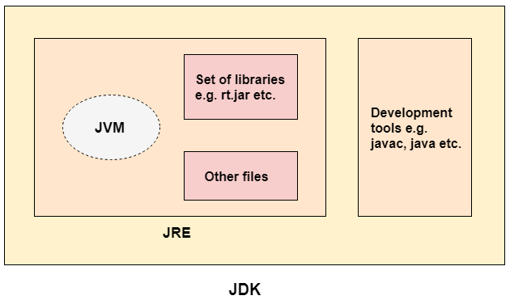

# What is Java?

- Java is a programming language and a platform.
- Java is a __high level__, __robust__, __object-oriented__ and __secure__ programming language.

# Types of Java Applications

1) __Standalone Application__
    1) Standalone applications are also known as desktop applications or window-based applications.
    2) These are traditional software that we need to install on every machine.
    3) Examples of standalone application are Media player, antivirus, etc. AWT and Swing are used in Java for creating
       standalone applications.
2) __Web Application__ 
   1) An application that runs on the server side and creates a dynamic page is called a web application. Currently, Servlet, JSP, Struts, Spring, Hibernate, JSF, etc. technologies are used for creating web applications in Java.
3) __Enterprise Application__
4) __Mobile Application__

# Java Platforms / Editions
1) __Java SE (Java Standard Edition)__
   - It is a Java programming platform. 
   - It includes Java programming APIs such as java.lang, java.io, java.net, java.util, java.sql, java.math etc. 
   - It includes core topics like OOPs, String, Regex, Exception, Inner classes, Multithreading, I/O Stream, Networking, AWT, Swing, Reflection, Collection, etc.

2) __Java EE (Java Enterprise Edition)__
   - It is an enterprise platform that is mainly used to develop web and enterprise applications. 
   - It is built on top of the Java SE platform. It includes topics like Servlet, JSP, Web Services, EJB, JPA, etc.

3) Java ME (Java Micro Edition)
   - It is a micro platform that is dedicated to mobile applications.

4) JavaFX
   - It is used to develop rich internet applications. 
   - It uses a lightweight user interface API.
# Features of Java
1. Simple
2. Object-Oriented: Basic concepts of OOPs are:
   - Object 
   - Class 
   - Inheritance : IS-A relationship
   - Polymorphism 
   - Abstraction 
   - Encapsulation
3. Portable
4. Platform independent
5. Secured
6. Robust
7. Architecture neutral
8. Interpreted
9. High Performance
10. Multithreaded
11. Distributed
12. Dynamic

### Compile Time: 
Java Code (.java) -> Byte Code (.class)

### RunTime:
1. __Classloader__: It is the subsystem of JVM that is used to load class files. (Input: `.class` files)
2. __Bytecode Verifier__: Checks the code fragments for illegal code that can violate access rights to objects.
3. __Interpreter__: Read bytecode stream then execute the instructions.

### * It is possible to save a Java source file by another name than the class name.

# JVM
- JVM (Java Virtual Machine) is an abstract machine. 
- It is called a virtual machine because it doesn't physically exist.
- It is a specification that provides a runtime environment in which Java bytecode can be executed.
- JVM, JRE, and JDK are platform dependent because the configuration of each OS is different from each other.
- Java is platform independent.

### The JVM performs the following main tasks:

1. Loads code
2. Verifies code
3. Executes code
4. Provides runtime environment

# JRE (Java Runtime Environment)
- The JRE is a set of software tools which are used for developing Java applications.
- It contains a set of libraries + other files that JVM uses at runtime.

# JDK (Java Development Kit)
- The JDK is a software development environment which is used to develop Java applications and applets. It physically exists. It contains JRE + development tools.
- The JDK contains:
  - a private Java Virtual Machine (JVM) 
  - a few other resources such as an interpreter/loader (java), a compiler (javac), an archiver (jar), a documentation generator (Javadoc), etc.

